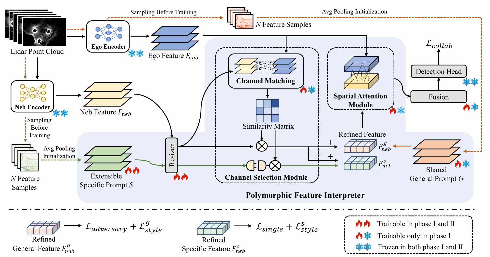

# One is Plenty: A Polymorphic Feature Interpreter for Immutable Heterogeneous Collaborative Perception [CVPR 2025]

This is the official implementation of CVPR2025 paper ["One is Plenty: A Polymorphic Feature Interpreter for Immutable Heterogeneous Collaborative Perception"](https://arxiv.org/abs/2411.16799). Yuchen Xia, Quan Yuan, Guiyang Luo, Xiaoyuan Fu, Yang Li, Xuanhan Zhu, Tianyou Luo, Siheng Chen, Jinglin Li.


## Installation
This repo is mainly based on the cooperative detection framework OpenCOOD. Therefore, the installations are the same.

```
# Clone repo
git clone https://github.com/yuchen-xia/PolyInter.git

# Setup conda environment
conda create -y --name polyinter python=3.7

conda activate polyinter

# Install torch
pip install torch==1.13.1+cu117 torchvision==0.14.1+cu117 torchaudio==0.13.1 --extra-index-url https://download.pytorch.org/whl/cu117

# spconv install
pip install spconv-cu117

# Install dependencies
pip install -r requirements.txt

# Install bbx nms calculation cuda version
python opencood/utils/setup.py build_ext --inplace

# install opencood into the environment
python setup.py develop
```

## Data Downloading
All the data (train-003.zip, validate-002.zip, test-012.zip, additional-001.zip) can be downloaded from [google drive](https://ucla.app.box.com/v/UCLA-MobilityLab-OPV2V). 
```
PolyInter
├── dataset # the downloaded opv2v data
│   ├── train
│   ├── validate
│   ├── test
│   ├── additional
├── opencood # the core codebase
```

## PolyInter Stage1 Training
First, train the single agent's encoder and detection head. The training process can refer to the [OpenCOOD](https://github.com/DerrickXuNu/OpenCOOD) process. Our pre-trained single agent models can be downloaded from [pre_train_modules.zip](https://drive.google.com/file/d/1Dkpy2Pzt1Y6g6UTMsQraS04TTm9OnkLT/view?usp=sharing). Place the single agent model files into `opencood/pre_train_modules`. In the corresponding yaml configuration file, modify `model.args.encoder_*.saved_pth` to the path of the model files.

Then execute the following command to start Stage1 training:
```
python opencood/tools/train.py --hypes_yaml ${CONFIG_FILE} [--model_dir  ${CHECKPOINT_FOLDER} --half]
```
For example​​, when training with three agent types in Stage1 (pp8 (ego), vn4, pp4), execute the command:
```
python opencood/tools/train.py --hypes_yaml opencood/hypes_yaml/PolyInter_stage1/stage1_pp8_vn4_pp4_fcooper_opv2v.yaml
```

The trained Stage1 model files will be saved in `checkpoints`.

To test the trained Stage1 model, execute the following command to start inference:
```
python opencood/tools/inference.py --model_dir ${CHECKPOINT_FOLDER}
```
To configure neighbor agent type for testing, set `selected_char` to 'k' or 'v' in the function `collate_batch_test_helper` within the file:  
`opencood/data_utils/datasets/intermediate_heter_pair_polyinter_stage1_fusion_dataset.py`.  

## PolyInter Stage2 Training
Execute the following command to start Stage2 training:
```
python opencood/tools/train.py --hypes_yaml ${CONFIG_FILE} [--model_dir  ${CHECKPOINT_FOLDER} --half]
```
For example, when training in Stage2 with pp8 (ego) and sd1 (neighbor), while using a Stage1 model trained on pp8, vn4, pp4, execute the command:  
```
python opencood/tools/train.py --hypes_yaml opencood/hypes_yaml/PolyInter_stage2/stage2_pp8_sd1__pp8_vn4_pp4_fcooper_opv2v.yaml
```

The trained Stage2 model files will be saved in `checkpoints`.

To test the trained Stage2 model, execute the following command to start inference:
```
python opencood/tools/inference.py --model_dir ${CHECKPOINT_FOLDER}
```
